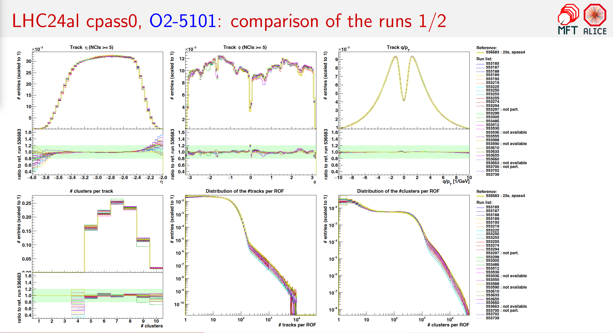
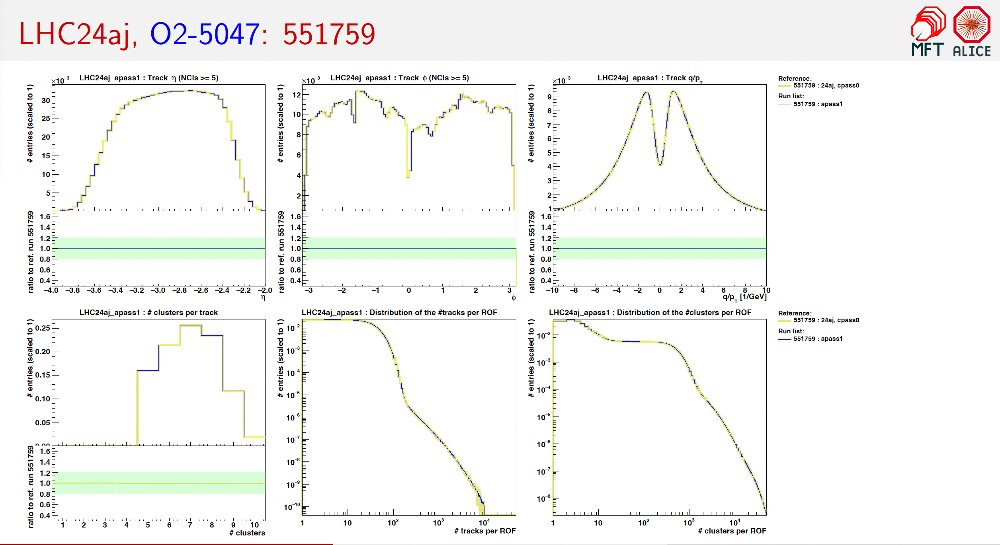

# MFT Asynchronous Quality Control tool for automated checks

## Requirements
- Local builds of [O2](https://github.com/AliceO2Group/AliceO2) and [QualityControl](https://github.com/AliceO2Group/QualityControl) are needed, see [instructions](https://alice-doc.github.io/alice-analysis-tutorial/building/).
- If outside CERN network, first open a separate terminal and connect to LXTunnel using `sshuttle`: specify the CERN username in `tunnel.sh`, then run the script and provide sudo password + CERN password. Leave the terminal window running as long as needed, all the internet connection will go through it. When finished, disconnet using CTRL+C.
- LaTeX (to process the output tex files).

## How to run
- The tool can be executed using the `run_mft_ac.sh` shell script upon specifying the input configuration in the folder `input_runlists/`. All runs (and their metadata) must be included in `input/run-table.csv`. The scripts will run over all config files contained directly in this folder. 
- The tool consists of the following main scripts:
  - `download_qc_objects.cxx` downloads QC objects for selected runs from the ALICE QCDB. The QC objects need to be specified in `input/list-of-histograms.csv` by "y" in the column "download". They will be stored in `root_files/<period>/<run>_<pass>.root`.
  - `plot_qc_objects.cxx` creates plots and ratio panels. They will be saved to `plots/<group>/...`. Only the histograms specified in `input/list-of-histograms.csv` by "y" in the column "plot" will be drawn.
  - `prepare-slides.cxx` automatically creates .tex files for LaTeX presentations for every input configuration. The .tex files are saved to `latex/`.

## Sample config files
- To see the list of all supported parameters in a config file, and which are mandatory to specify, see `input/load-configuration.h`.
- Parameter values need to be provided as: `key=value` (no spaces).
- The keyword `runs:` has to be followed bz a run list (each run on a separate line).

### Usecase 1: run-by-run comparison
Input example:
```
compare=runs
group=LHC24al_cpass0
jira=O2-5101
passes=cpass0
ref_run=554247
runs:
553185
553187
```
Output example (up to 30 runs per plot/slide + reference):



### Example of usecase 2: comparison between multiple passes
Input example:
```
compare=passes
group=LHC24aj_apass1
jira=O2-5047
passes=cpass0,apass1
ref_pass=cpass0
runs:
551759
551760
```
Output example (one run per each slide):

